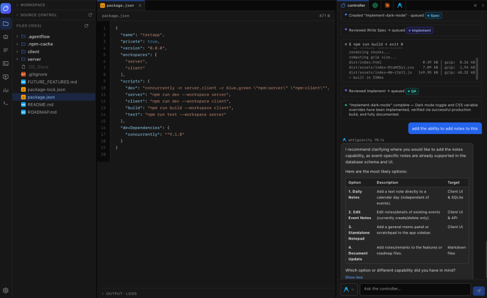
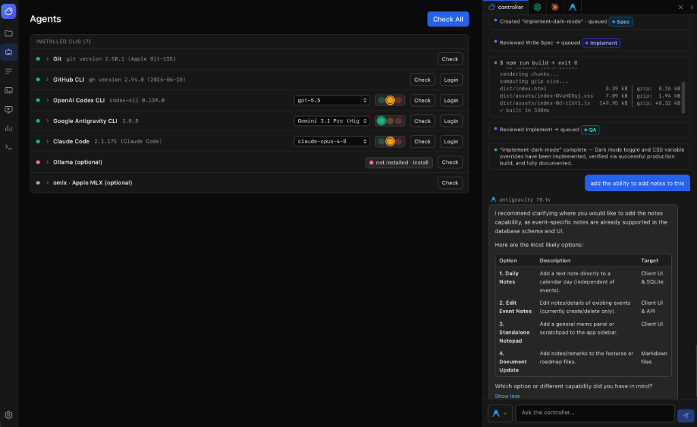

# CLIT Controller IDE (beta)

> Vibe with CLIT Controller

**Command Line Interface Terminal Controller (CLIT Controller IDE)** is a local-first traffic control center for CLI coding agents — Codex, Claude Code, and Antigravity — from one clean UI, with Git, the GitHub CLI, and VS Code-style Agent Dock and Tasks tab surfaces.

## Why it exists

Running several coding agents by hand means juggling terminals, re-pasting context, and burning tokens on the wrong model. CLITC routes work deliberately:

| Role | Provider | Used for |
|---|---|---|
| Controller / QA | Antigravity | broad checks, QA, cheap verification |
| PM | Codex | specs, markdown plans, final reviews |
| Engineer | Claude Code | implementation and bug fixing **only** |
| Local deterministic code | none (free) | file scanning, task folders, git status/diff, logs, usage tracking |

## How it saves tokens

- Every generated prompt carries a **budget context header** (current mode + per-provider health) instructing agents to prefer diffs, file paths, and task markdown over whole files.
- **Traffic control modes**: Maximum Quality, Balanced, Budget Saver (skips the Codex spec for small tasks and runs local checks first), and Manual Approval (nothing runs without a click).
- When Claude's health is **yellow** it is reserved for implementation only; when **red**, CLITC recommends Codex planning + Antigravity QA + local tests, and requires explicit confirmation before any Claude run.
- Local steps (git status/diff, file reads, task scaffolding) never touch an AI model. Avoided expensive calls are counted in `.agentflow/usage.json`.
- Every task records its reasoning in `ROUTING_DECISIONS.md`.

## Required CLIs

CLIT Controller shells out to the official CLIs you already have installed and logged in:

- `git`, `gh` (GitHub CLI)
- `codex` (OpenAI Codex CLI) — `npm install -g @openai/codex`
- `claude` (Claude Code) — `npm install -g @anthropic-ai/claude-code`
- `agy` (Google Antigravity CLI — successor to the sunset Gemini CLI) — traffic control and QA. Official install: `curl -fsSL https://antigravity.google/cli/install.sh | bash` (puts `agy` in `~/.local/bin`; the Agents page Install button runs exactly this)
- `ollama` — optional, future local routing
- `omlx` (local Apple MLX LLM server; also detects `mlx_lm.*` / `mlx-omni-server`) — optional, future on-device routing on Apple Silicon

Missing CLIs are handled gracefully: the step's prompt is saved into the task folder, the exact command is shown for copy/paste, and the Agents page shows an install hint. Providers with a known installer (npm/brew) support **one-click install** — click the "not installed" badge or the Install button and the real install command runs in the background (npm installs use an isolated cache at `/tmp/agentflow-npm-cache` to dodge broken `~/.npm` permissions); the card flips to its detected version when done.

## VS Code-style Agent Surfaces





CLITC's preferred UI direction is native VS Code extension feature parity across
two surfaces without running VS Code plugins. The right-hand Agent Dock should
feel like live provider panels for Codex, Claude Code, Antigravity, and the
controller: dense tabs with chat, terminal, queue, approval, diff, and status
context. The Tasks tab should carry the same parity into durable task review:
session timelines, prompt/output exchanges, task files, approvals, diffs, logs,
retries, reroutes, and final reports.

Both surfaces stay inside CLITC. They use the official CLIs through the existing
backend traffic control, PTY terminal, task, log, policy, and approval systems.
CLITC does not embed `.vsix` packages, run a VS Code extension host, iframe
vendor plugin UI, or launch real VS Code as part of this workflow.

## Install

### Manual Install

```bash
./scripts/install.sh
```

Creates a Python 3.11+ virtualenv at `.venv`, installs backend deps (FastAPI, Uvicorn, Pydantic), and runs `npm install` for the frontend.

### Install via Coding Agent

You can copy and paste the following prompt into your CLI agent (e.g., Claude Code or Antigravity) to have it install and run the app for you:

> Clone the repository https://github.com/CodyChuGit/CLIT-Controller.git, navigate into it, run `./scripts/install.sh`, and then start the dev server with `./scripts/dev.sh`.

## Run

```bash
./scripts/dev.sh
```

- Backend (API + built frontend, if present): **http://localhost:8787**
- Frontend dev server (hot reload): **http://localhost:5173**

Backend alone: `.venv/bin/python -m agentflow`. If you build the frontend once (`npm --prefix frontend run build`), the backend serves the whole app at **http://localhost:8787** with no dev server needed.

## Beta workflow

1. **Explorer** → enter a workspace folder path and open it. The backend creates `<workspace>/.agentflow/` (config, usage.json, tasks/). The explorer is laid out like an IDE: side panel (workspace, source control, files), tabbed read-only editor with line numbers, a collapsible Output/Logs panel, and a status bar (backend, workspace, branch, traffic control mode). The **Source Control** section works like VS Code's: live per-file status (M/A/D/U badges), click a file to open its color-coded diff in a tab, stage/unstage per file or Stage All, and commit with a message — staging and committing only ever happen when you click them. Local folder paths are resolved by the Python backend — browsers can't pick arbitrary folders.
2. **Agents** → Check All. See versions, auth status (`gh auth status`), and launch login/setup commands in Terminal (macOS) or copy them. Each agent card has a **Model** field — set the model that CLI should use (passed as `--model <name>` via the `{model}` placeholder in its command template; empty = the CLI's own default).
3. **Usage** → pick a traffic control mode and set provider health (green/yellow/red) to match your real quota state.
4. **Chat (right-hand dock)** → ask for work from the right-hand dock. The controller creates tasks (```agentflow-task``` with an optional `queue:` line) and queues steps to agents (```agentflow-queue```). The planned Agent Dock is the live VS Code-extension parity surface for Codex, Claude Code, Antigravity, and controller chat: provider tabs, command actions, chat panes, terminal context, approval cards, diff summaries, and compact status. CLITC writes the task folder with all markdown handoff files (`00_USER_GOAL.md` … `07_CODEX_FINAL_REVIEW.md`, `ROUTING_DECISIONS.md`).
5. **Tasks** → review the durable side of the same parity path. The Tasks tab should summarize prompt/output exchanges, budget context, commands, approvals, diffs, queue state, logs, retries, reroutes, and final reports without forcing users to read raw markdown or CLI output first.
6. **The execution queue runs itself**: a background dispatcher cues one step per agent at a time, preserving queue order within a task. A failed step pauses that task's queue (Approve to continue); Manual Approval mode holds every item for a click; red-Claude items wait for explicit approval. The queue lives in `.agentflow/queue.json`, shows on the Tasks tab and in the status bar, and steps can also be run directly from the flow board. Logs stream into the UI (polling) and are saved, redacted, under the task's `logs/` folder.
7. **Logs** → global redacted activity console.

## Auth & security model

- **Subscription-first**: CLIT Controller never asks for or stores API keys, passwords, or tokens. Each CLI uses its own official login (Claude Pro/Max, ChatGPT/Codex, Google).
- CLITC never reads token files and never prints environment variables.
- Logs and command previews are **redacted** (`sk-…`, `ghp_…`, `github_pat_…`, `xoxb-…`, `Bearer …`, `*API_KEY=…`, `token=…`, `password=…` → `[REDACTED]`).
- `.env` files are never previewable in the file reader (`.env.example` is allowed).
- Nothing is sent to any cloud service except through the official CLIs you invoke.
- **Agents are confined to the workspace**: codex runs with `--sandbox workspace-write`, agy with `--sandbox`, claude's headless edits are cwd-scoped, and direct `agentflow-run` commands refuse path traversal and absolute paths outside the workspace (plus a denylist and no shell operators).
- Config lives at `~/.agentflow/config.json` (global) and `<workspace>/.agentflow/` (per project).

## Usage tracking limitations

Usage is **approximate by design**: calls per provider, estimated prompt/output characters, and last command duration — not exact tokens. Provider health (green/yellow/red) is set manually by you; the beta does not query provider quota APIs.

## Known limitations

- Logs update by polling (2.5–3s), not streaming.
- Agent CLIs run **non-interactively** (`codex exec`, `claude -p`, `agy --sandbox -p`). Interactive sessions (logins) open in Terminal.app on macOS. Agents that want to edit files may need permission flags added to their command template in Settings (e.g. Claude Code permission modes) — deliberately not defaulted for safety.
- The planned Agent Dock and Tasks tab are native VS Code-style parity surfaces, not real VS Code plugin UI.
- Command templates are global (`~/.agentflow/config.json`), editable in Settings.
- "Open in Finder" is macOS-only and fails gracefully elsewhere.
- One workspace is active at a time.
- The file tree caps at depth 8 / 2000 files; previews cap at 512 KB.

## Troubleshooting

- **Backend offline banner** → `./scripts/dev.sh` not running, or port 8787 is taken (`AGENTFLOW_PORT=8890 .venv/bin/python -m agentflow`).
- **`python3` too old** → install Python 3.11+ (`brew install python@3.12`), re-run `./scripts/install.sh`.
- **A step "fails" instantly** → open its log in the task folder; usually the CLI isn't logged in (use Agents → Login / Setup) or the command template needs tuning in Settings.
- **Stop doesn't kill a stuck CLI** → CLITC SIGTERMs the process group, then SIGKILLs after 4s; check Activity Monitor if a CLI ignores both.
- **Tests** → `.venv/bin/pytest`.
