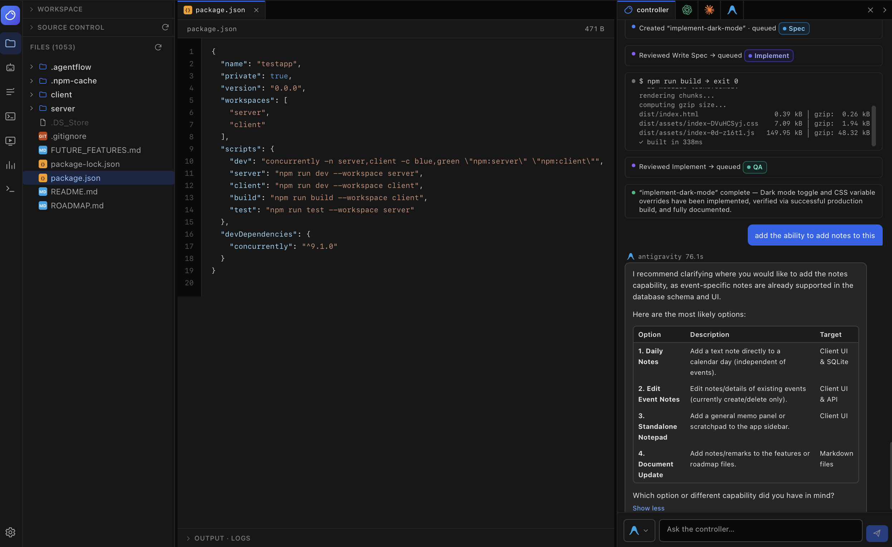

# CLIT Controller IDE

<p align="center">
  
</p>

<p align="center">
  <strong>Vibe with CLIT Controller</strong><br>
  Plan design tasks, coordinate coding assistants, review changes, and keep the whole flow in one unified interface.
</p>

---

## 🫘 What It Is

**CLIT Controller IDE** is a visual control room for designers who use AI coding assistants to bring interface ideas to life.

Instead of bouncing between chats, terminals, folders, diffs, and task notes, you get one place to describe the work, route it to the right assistant, watch progress, and review the result before moving forward.


*Workspace view with project files, active tasks, file changes, and the task queue.*


*Agents view for checking connected assistants, setup status, and configuration.*

## 💡 Why You Need It

AI-assisted design work gets messy fast. One assistant is good at planning, another is better at implementation, another is useful for review. Without a controller, the designer becomes the glue: copying prompts, pasting context, checking files, repeating constraints, and hoping the expensive model is used for the right job.

CLIT Controller keeps that workflow tidy.

| Problem | How CLIT Controller Helps |
|---|---|
| Token waste | Routes work intentionally so high-cost assistants are saved for the tasks that need them. |
| Copy-paste fatigue | Keeps project context, task notes, logs, and handoffs together. |
| Lost design intent | Preserves requests, references, approvals, and review history inside the workspace. |
| Slow review loops | Surfaces generated output, file changes, and logs in one place. |
| Too many terminals | Lets designers coordinate Codex, Claude Code, and Antigravity from a single UI. |

The goal is simple: **less prompt wrangling, more product shaping**.

## ⬇️ Install

Clone the project, then run:

```bash
./scripts/install.sh
```

Start the app:

```bash
./scripts/dev.sh
```

Open the local app:

```text
http://localhost:5173
```

The install script creates a local Python environment, installs the app backend, and installs the frontend packages. If an assistant is missing, the app shows setup guidance in the Agents view.

## 🧰 Requirements

### Core App

- **Python 3.11+** for the local backend.
- **Node.js and npm** for the frontend.
- **git** for workspace status, diffs, and source control context.
- **GitHub CLI (`gh`)** for GitHub-aware workflows.

### AI Assistants

CLIT Controller works with the official command-line tools you already use:

- **Codex CLI**: `npm install -g @openai/codex`
- **Claude Code**: `npm install -g @anthropic-ai/claude-code`
- **Antigravity CLI**: `curl -fsSL https://antigravity.google/cli/install.sh | bash`

Each assistant keeps its own official login. CLIT Controller does not ask for or store provider keys or tokens.

### Packages Installed By The App

- Backend: FastAPI, Uvicorn, Pydantic.
- Frontend: React, Vite, TypeScript, Tailwind CSS, xterm, Prism.
- Dev/test support: pytest.

## 🗺️ Roadmap

- **Richer designer task briefs**: clearer intake for goals, references, constraints, acceptance notes, and visual QA.
- **UI/UX reference library**: collect reusable style references and local design examples for faster frontend iteration.
- **Live output everywhere**: smoother real-time assistant progress across tasks, logs, approvals, and reviews.
- **App-mode launcher**: a more polished standalone desktop-style launch experience.
- **Local voice I/O**: optional dictation and spoken summaries for hands-light task review.
- **More review intelligence**: better summaries of what changed, what still needs attention, and where design intent may have drifted.

## 🙌 Credits

Built for designers who want AI help without losing control of the craft.

Powered by the work of the OpenAI Codex, Anthropic Claude Code, Google Antigravity, React, Vite, FastAPI, and open-source communities.

---

<p align="center">
  <em>Vibe with CLIT Controller.</em>
</p>
