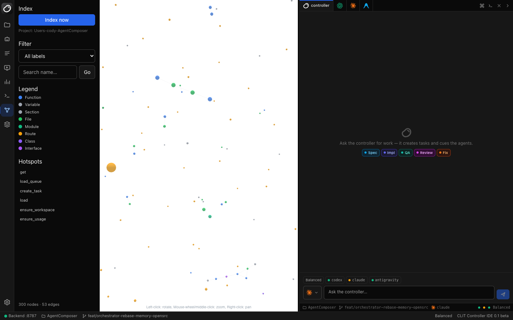
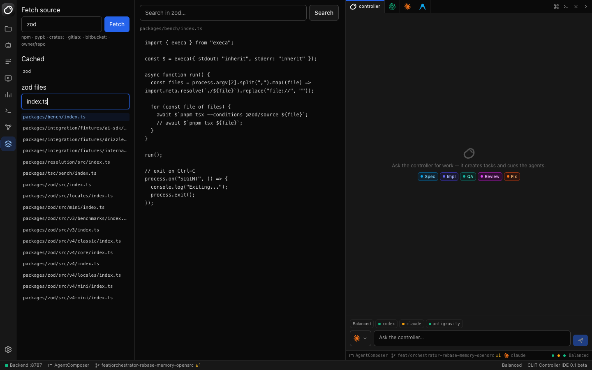
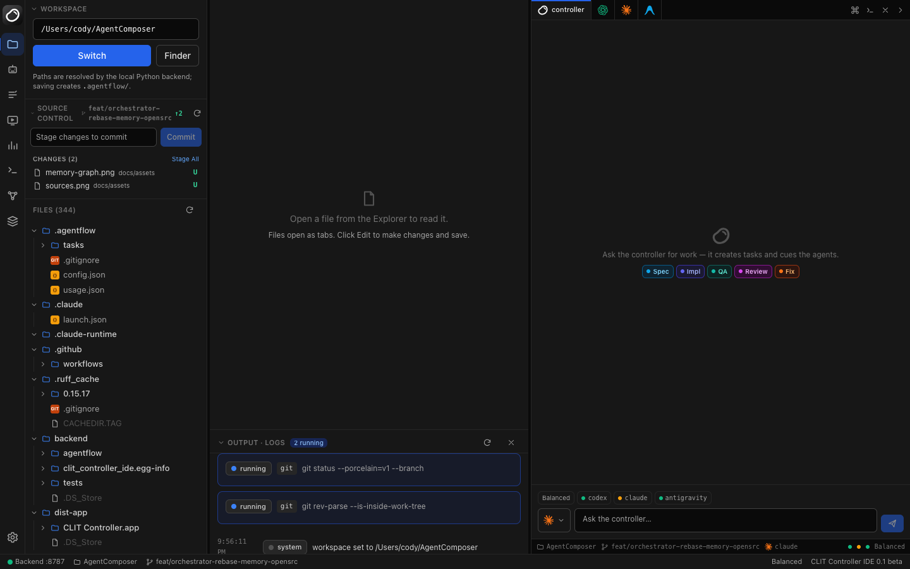
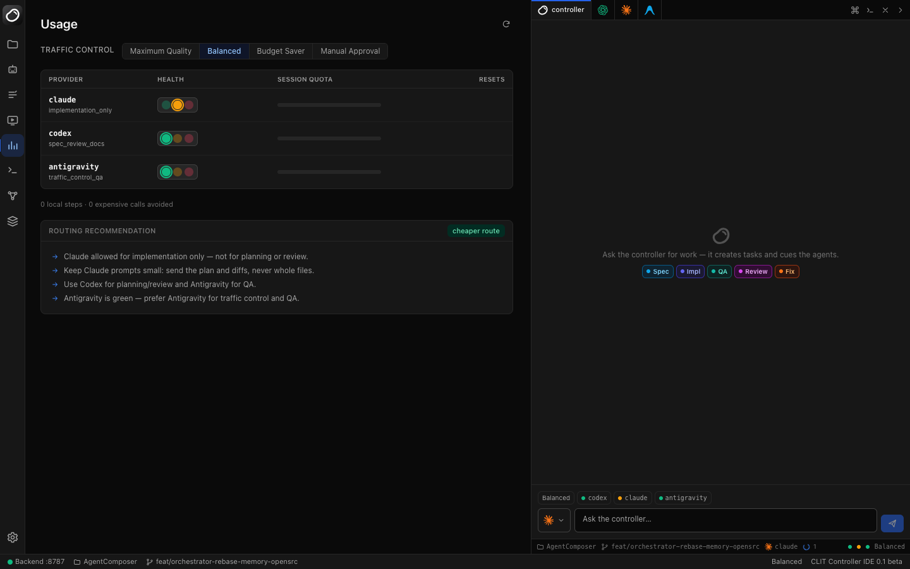

# CLIT Controller IDE

<p align="center">
  
</p>

<p align="center">
  <strong>Vibe with CLIT Controller</strong><br>
  A local-first control room for CLI coding agents.
</p>

CLIT Controller IDE is a visual interface for coordinating user-installed coding
CLIs. It runs Codex, Claude Code, Antigravity, git, and local commands on your
machine, then shows their work as live, reviewable task flow instead of forcing
you to manage several terminals by hand.

## What It Does

| Surface | Purpose |
| --- | --- |
| Explorer | Workspace picker, file tree, editor tabs, git status, diffs, stage/unstage/commit. |
| Agent Dock | Right-hand live control center: controller chat, provider tabs, PTY terminals, approvals, event cards, live streamed output. |
| Tasks | Provider-lane task workbench that shows controller decisions, Codex/Claude/Antigravity/local work, queue state, artifacts, changed files, and raw detail. |
| Agents | CLI detection, one-click install, login helpers, model selection. |
| Usage | Budget/traffic-control mode, provider health, live quota where available. |
| Preview | Start and monitor a localhost preview/dev server for the selected workspace. |
| Logs | Redacted global logs and active run tails. |
| Memory | 3D codebase knowledge-graph explorer (via `codebase-memory-mcp`): index the workspace, filter/search nodes, hotspots, and a node drawer with source + callers/callees. |
| Sources | Fetch and browse any open-source package's real source (via `opensrc`) — for you and the agents. |
| Settings | Routing defaults, command templates, Headroom proxy, and Ponytail prompt discipline. |

> **Note on live quota:** Codex (session `rate_limits` on disk) and Claude Code
> (`claude -p "/usage"` intercepted headlessly) report real remaining quota, so
> the Usage page shows live numbers for both. Antigravity (`agy`) does not — as of
> v1.0.16 its `/usage` / `/quota` / `/credits` panels are interactive-TUI only,
> with no headless flag, JSON output, or on-disk snapshot to read, so it falls
> back to a manual limit. **Please, Google: ship a headless usage API for `agy`
> (parity with Codex and Claude) so we can patch this and show real Antigravity
> quota.**

> **Optional integrations & the engine:** the **Memory** and **Sources** tabs
> light up once their local tools are installed (one-click from the **Agents**
> tab): `codebase-memory-mcp` (code knowledge graph) and `opensrc` (source
> fetcher; needs Node ≥ 24). The routing / dispatch / usage-fallback engine is
> imported from the `Agent_CLI_Skill` project — set `AGENTCLI_CORE_PATH` to its
> `scripts/` dir, or the vendored snapshot under
> `backend/agentflow/orchestrator/_engine_snapshot/` is used (refresh it with
> `scripts/sync-engine.sh`).

## Screenshots

|  |  |
| --- | --- |
|  |  |
| **Memory** — this repo indexed into a 3D knowledge graph (via `codebase-memory-mcp`): filter, search, hotspots, and a node drawer with source + callers/callees. | **Sources** — fetch and read any open-source package's real source (via `opensrc`), right next to your workspace. |
|  |  |
| **Explorer** — workspace picker, file tree, git status/diffs, and live run output. | **Usage** — traffic-control modes, per-provider health, and the engine's routing recommendations. |

## Agent Roles

| Provider | Default Role | Notes |
| --- | --- | --- |
| `claude` | Controller and engineer | Default traffic controller; also handles implementation and fixes. |
| `codex` | PM / spec / review | Specs, plans, final reviews, and product judgment. |
| `antigravity` / `agy` | QA and broad checks | Tool-running, QA, second opinions, and terminal-based investigation. |
| local tools | Workspace helper | git, shell commands, tests, preview servers, logs, and file operations. |

The controller uses the deterministic `CLITC_RESULT_V1` protocol for actions.
Legacy `agentflow-*` directive blocks still work as a compatibility fallback, but
validated controller actions are the primary mutation path.

## Installation

macOS and Linux are supported.

### 1. Prerequisites

| Tool | Version | Install (macOS) |
| --- | --- | --- |
| Python | 3.11+ | `brew install python@3.12` |
| Node.js | 20+ (24+ for the Sources/opensrc tab) | `brew install node` |
| git | any | `xcode-select --install` |

`gh` (GitHub CLI) is optional but recommended. On Linux, use your package
manager (`apt install python3 nodejs git`, etc.).

### 2. One-command setup

```bash
git clone https://github.com/CodyChuGit/CLIT-Controller.git
cd CLIT-Controller
make setup     # creates .venv, installs backend (editable) + frontend deps
make dev       # backend on :8787, Vite dev server on :5180 (hot reload)
```

Open **http://localhost:5180**. (`make setup` / `make dev` wrap
`./scripts/install.sh` and `./scripts/dev.sh` — run those directly if you
prefer. The installer finds Python 3.11+, creates the venv, and retries `npm
install` with an isolated cache if your `~/.npm` has permission issues.)

Single-port, production-style run (built SPA + API on one port):

```bash
npm --prefix frontend run build
AGENTFLOW_PORT=8787 .venv/bin/python -m agentflow   # then open http://localhost:8787
```

### 3. Agent CLIs — install at least one

CLIT Controller drives *your* locally-installed coding CLIs. Install them
one-click from the **Agents** tab, or by hand:

| Agent | Install |
| --- | --- |
| Codex | `npm install -g @openai/codex` |
| Claude Code | `npm install -g @anthropic-ai/claude-code` |
| Antigravity (`agy`) | `curl -fsSL https://antigravity.google/cli/install.sh \| bash` |

Each provider authenticates through its own login/keychain — CLIT Controller
never stores provider API keys, passwords, or tokens.

### 4. Optional integrations

One-click installable from the **Agents** tab, or:

| Tool | Powers | Install |
| --- | --- | --- |
| `codebase-memory-mcp` | the **Memory** knowledge-graph tab | `curl -fsSL https://raw.githubusercontent.com/DeusData/codebase-memory-mcp/main/install.sh \| bash` |
| `opensrc` | the **Sources** tab + agent source access | `npm install -g opensrc` (needs Node 24+) |

The orchestration engine is imported from the `Agent_CLI_Skill` project — point
`AGENTCLI_CORE_PATH` at its `scripts/` dir, or run `scripts/sync-engine.sh` to
vendor a snapshot (used automatically as a fallback so CI works without it).

### 5. Verify

```bash
make verify    # ruff format + lint, mypy, backend pytest, frontend build + vitest
```

## Runtime Model

- FastAPI backend: `backend/agentflow`
- React/Vite frontend: `frontend/src`
- Global state: `~/.agentflow/`
- Workspace state: `<workspace>/.agentflow/`
- Live managed-run output: `/api/events/stream` with `/api/events?cursor=` polling fallback
- Interactive terminals: `/api/terminals/{provider}/ws` WebSockets
- PTY terminal diagnostics: `/api/terminals/{provider}/diagnostics`

Managed output streams through a single workspace event store. Interactive
provider tabs use real PTY sessions and xterm.js.

## Token Controls

CLIT Controller has two token-saving layers:

- **Headroom**: input-side context compression, embedded as a Python library
  (`headroom-ai`, installed with the backend). CLITC calls it in-process to crush
  bulky machine context (step output tails, task-state summaries) inside the
  prompts it builds — no proxy, and only CLITC's own agent runs are affected.
  Enabled by default and fail-open: any failure leaves the prompt unchanged.
- **Ponytail**: output-side prompt discipline injected into agent prompts. The
  default level is `full`; adjust it in Settings.

## Common Commands

```bash
make setup
make dev
make test-backend
make test-frontend
make build
make verify
```

Run the smallest relevant command for the change you made; `make verify` is the
full local gate.

## Documentation

Start at [docs/INDEX.md](docs/INDEX.md).

Key references:

- [docs/GETTING_STARTED.md](docs/GETTING_STARTED.md)
- [docs/PRODUCT_OVERVIEW.md](docs/PRODUCT_OVERVIEW.md)
- [docs/ARCHITECTURE.md](docs/ARCHITECTURE.md)
- [docs/API.md](docs/API.md)
- [docs/FEATURE_STATUS.md](docs/FEATURE_STATUS.md)
- [docs/TESTING.md](docs/TESTING.md)
- [docs/TROUBLESHOOTING.md](docs/TROUBLESHOOTING.md)
