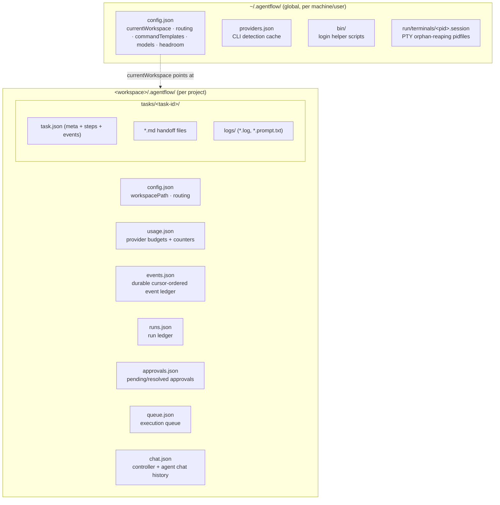

# Data Model — CLIT Controller IDE (AgentComposer)

There is **no database**. All persistent state is plaintext JSON on the local
filesystem, owned by a single user on a loopback-only backend. This document is the
authoritative reference for *what is stored, where, and how it lives* — entity shapes,
identifiers, lifecycle, ownership, atomic-write guarantees, bounded sizes, redaction,
schema evolution, and recovery on restart.

For surrounding context, see [ARCHITECTURE.md](ARCHITECTURE.md) (how the parts fit),
[OPERATIONS.md](OPERATIONS.md) §5 (operator-facing state/data locations and
backup/reset), [SECURITY.md](SECURITY.md) (redaction + residual risks), and
[PILLARS.md](PILLARS.md) (the product pillars these files serve).

## Contents

1. [Storage principles](#1-storage-principles)
2. [Layout overview](#2-layout-overview)
3. [Global state — `~/.agentflow/`](#3-global-state--agentflow)
4. [Per-workspace state — `<workspace>/.agentflow/`](#4-per-workspace-state--workspaceagentflow)
5. [Bounded sizes (caps)](#5-bounded-sizes-caps)
6. [Redaction](#6-redaction)
7. [Recovery on restart](#7-recovery-on-restart)
8. [Schema evolution — no migrations](#8-schema-evolution--no-migrations)
9. [Deterministic output contracts](#9-deterministic-output-contracts)

---

## 1. Storage principles

- **Plaintext JSON, human-readable.** Indented (`indent=2`), `ensure_ascii=False`, with
  a trailing newline. See `write_json` in
  [config.py](../backend/agentflow/config.py).
- **Atomic writes.** Every write goes through `config.write_json`, which writes a
  temp file (`mkstemp` in the destination directory) and then `os.replace`s it into
  place. The rename is atomic on the same filesystem, so a reader never sees a
  half-written file and a crash mid-write leaves the previous file intact. All the
  service modules below route their saves through this one function.
- **Tolerant reads.** `config.read_json(path, default)` returns the supplied default on
  both `FileNotFoundError` and `json.JSONDecodeError` — a missing or corrupt file
  degrades to "empty", never a crash.
- **No locking.** Single-user, loopback-only design (no auth — see
  [SECURITY.md](SECURITY.md)). Concurrency is cooperative within one backend process;
  there is no cross-process file lock.
- **Path ownership.** All paths are computed centrally in
  [paths.py](../backend/agentflow/paths.py) (constant `APP_DIR_NAME = ".agentflow"`),
  so no module hardcodes a location.
- **Self-ignored.** On `ensure_workspace`, a `<workspace>/.agentflow/.gitignore`
  containing `*` is written so the app's own state never lands in the user's repo
  (without touching the repo's own `.gitignore`). See `ensure_workspace` in
  [config.py](../backend/agentflow/config.py).

## 2. Layout overview



Global state is keyed by machine/user (one set per login). Per-workspace state lives
inside each project folder the user selects, so it travels with the project and a
workspace can be deleted by deleting its `.agentflow/` directory.

## 3. Global state — `~/.agentflow/`

Computed by `global_config_dir()` and friends in
[paths.py](../backend/agentflow/paths.py).

### `config.json` — global configuration

Loaded/merged by `load_global_config` in [config.py](../backend/agentflow/config.py).
Shape (keys backfilled via `setdefault` on every load):

| Field | Type | Meaning |
| --- | --- | --- |
| `currentWorkspace` | string \| null | Absolute path of the selected workspace. `get_current_workspace()` returns it only if it still resolves to a directory. |
| `routing` | object | Role → provider id map. Default `{orchestrator: antigravity, pm: codex, engineer: claude, qa: antigravity}` (`DEFAULT_ROUTING`). |
| `commandTemplates` | object | Provider id → argv template string. Defaults in `DEFAULT_COMMAND_TEMPLATES`; `{prompt}` and `{model}` are placeholders (see note below). |
| `models` | object | Provider id → model name (`""`/absent means "CLI default"). |
| `headroom` | object | Optional Headroom token-saving proxy settings (Pillar 1). Empty by default; the merged-with-defaults view lives in `headroom_service.settings()`. |

- **Identifier:** singleton (one file per machine).
- **Lifecycle:** read on demand; written by `save_global_config` / `update_settings`
  / `set_workspace`. `update_settings` also mirrors `routing` into the current
  workspace's `config.json` so a workspace keeps the routing in effect when selected.
- **Schema evolution / backfill:** missing keys are defaulted on every read. Two
  forward-migrations run automatically: `_migrate_gemini` rewrites the retired
  `gemini` provider to `antigravity` in routing, and `_STALE_TEMPLATES` upgrades
  previously-shipped default command templates to the current ones. The `gemini`
  command template is dropped.
- **Command-template placeholders:** `{prompt}` is replaced with the generated prompt
  as a single argv element (parsed with `shlex`, never interpolated into a shell
  string); `{model}` expands to `--model <configured model>` or disappears when
  unset. See the comment block above `DEFAULT_COMMAND_TEMPLATES`.

### `providers.json` — CLI detection cache

Read/written by `_load_cache` / `_save_cache` in
[provider_probe.py](../backend/agentflow/provider_probe.py). A map of provider id →
last `check_provider` result, so the Providers UI can render without re-running
`--version`/auth probes on every load.

Per-provider record (from `check_provider`):

| Field | Type | Meaning |
| --- | --- | --- |
| `installed` | bool | Executable resolved on PATH (or a well-known user bin dir). |
| `executablePath` | string \| null | Resolved binary path. |
| `version` | string \| null | First line of `--version` output (truncated to 120 chars). |
| `status` | string | `ok` \| `version_unknown` \| `needs_login` \| `missing` \| `unchecked`. |
| `lastChecked` | ISO-8601 string | When the probe last ran. |
| `lastLog` | string | Redacted, tail-trimmed (≤4000 chars) probe transcript. |
| `modelOptions` | string[] | Models parsed from a CLI's `models` listing (when supported). |

- **Identifier:** keyed by provider id (`git`, `gh`, `codex`, `antigravity`,
  `claude`, `ollama`, …).
- **Lifecycle:** purely a cache. Safe to delete; the next "Check" rebuilds it. Static
  provider definitions live in code (`PROVIDERS` in provider_probe.py), not on disk.
- **Redaction:** `lastLog` is passed through `redact` before storage.

### `bin/` — login helper scripts

`login_scripts_dir()` → `~/.agentflow/bin/`. Holds generated provider-login helper
scripts. Not JSON state; listed here for completeness.

### `run/terminals/<pid>.session` — PTY orphan-reaping pidfiles

`terminals_run_dir()` → `~/.agentflow/run/terminals/`. One tiny text file per live PTY
session, named `<pid>.session`, whose contents are the shell path. Written by
`_record_session` and removed by `_clear_session_file` in
[terminal_service.py](../backend/agentflow/terminal_service.py).

- **Why it exists:** PTY sessions are detached (`start_new_session=True`) for clean
  TUI keystroke delivery, so they outlive a backend that is SIGKILLed before its
  shutdown hook runs. The pidfile lets `sweep_orphaned_sessions()` reap leaked
  process groups on the next startup.
- **Safety:** the sweep only signals a recorded pid that still looks like a detached
  shell we plausibly spawned (no controlling tty + matching shell name), guarding
  against PID reuse. See also [OPERATIONS.md](OPERATIONS.md) §6.

## 4. Per-workspace state — `<workspace>/.agentflow/`

Computed by `workspace_app_dir()` and friends in
[paths.py](../backend/agentflow/paths.py). Materialized by `ensure_workspace`
([config.py](../backend/agentflow/config.py)) the moment a workspace is selected:
it creates the app dir, `tasks/`, the self-ignore `.gitignore`, `config.json`, and
(via `usage_service.ensure_usage`) `usage.json`.

### `config.json` — workspace configuration

| Field | Type | Meaning |
| --- | --- | --- |
| `workspacePath` | string | Absolute path of this workspace. |
| `routing` | object | Per-workspace role → provider map (mirrors/overrides global routing). |

Plus any ad-hoc keys set via `set_workspace_setting`. Read with
`get_workspace_routing` (merged over `DEFAULT_ROUTING`, `gemini` migrated forward) and
`get_workspace_setting`.

### `usage.json` — approximate provider budgets and counters

Owned by [usage_service.py](../backend/agentflow/usage_service.py). Tracks
*approximate* per-provider usage (not billing). Top-level shape (`DEFAULT_USAGE`):

| Field | Type | Meaning |
| --- | --- | --- |
| `mode` | string | `subscription` (informational). |
| `orchestrationMode` | string | `balanced` \| `budget_saver` \| `manual_approval` — drives queue dispatch behavior. |
| `providers` | object | provider id → usage entry (below). |
| `expensiveCallsAvoided` | int | Counter incremented when budget logic skips a paid call. |
| `localStepsCompleted` | int | Counter for free/local steps run. |

Per-provider entry (`DEFAULT_PROVIDER_USAGE` / `_blank_provider`): `limitCalls`,
`windowHours`, `windowStartedAt`, `callsToday`, `manualBudgetLevel`,
`health` (`green`/`yellow`/`red`), `preferredUse`, `estimatedPromptChars`,
`estimatedOutputChars`, `lastCommandDuration`, `lastStatus`.

- **Identifier:** singleton per workspace; `providers` keyed by provider id.
- **Lifecycle:** `ensure_usage` creates it on first access and backfills missing keys.
  `_maybe_reset_window` zeroes the per-window counters once `windowHours` has elapsed.
  `record_call` accumulates char/duration estimates after each agent run.
- **Schema evolution:** missing top-level keys and per-provider keys are
  `setdefault`-backfilled; a legacy `gemini` provider entry is renamed to
  `antigravity` (carrying its stats forward) on load.
- **Live quota note:** the *real* rate-limit numbers shown in the UI are read live
  from the CLIs' own files at request time (`codex_live_usage` reads `~/.codex`
  session files; `claude_live_usage` shells `claude -p "/usage"`) and cached
  in-memory only — they are **not** persisted to `usage.json`.

### `events.json` — durable, cursor-ordered event ledger

Owned by [state_store.py](../backend/agentflow/state_store.py). The append-only
timeline of every task/queue/run/approval transition. This is authoritative for
*recovery and the polling fallback*; the live SSE stream is mirrored from the same
`append_event` call via the in-memory event bus.

Document shape:

```json
{ "schemaVersion": 1, "cursor": 137, "events": [ /* event objects */ ] }
```

Event object:

| Field | Type | Meaning |
| --- | --- | --- |
| `id` | int | Monotonic, equals the cursor value at append time. The polling client passes `after=<lastSeenId>`. |
| `time` | ISO-8601 string | UTC, seconds precision. |
| `type` | string | e.g. `task.created`, `run.started`, `run.finished`, `queue.dispatched`, `approval.required`, `recovery.completed`. |
| `taskId`, `step`, `provider` | string \| null | Correlation fields. |
| `detail` | string | Human-readable line (redacted). |
| `data` | object | Structured payload (redacted), carrying `runId`, `itemId`, status/transition info, etc. |

- **Identifier / cursor:** `cursor` is a per-workspace monotonic counter incremented
  on every append; the appended event's `id` is that value. `read_events(after, limit)`
  returns events with `id > after`, oldest first — this is the resumable polling cursor.
- **Lifecycle:** append-only; oldest events are pruned past the `MAX_EVENTS` cap (see
  §5). Created lazily by `_load_doc` on first append.
- **Redaction:** both `detail` and `data` are redacted *before* persisting — the
  durable timeline must never store secrets (audit P1-02; see §6).

> Note: tasks also keep a *separate* human-facing event log inside their own
> `task.json` (`events`, capped at `MAX_EVENTS = 300` in task_service.py). That is the
> traffic-control timeline for one task; `events.json` is the workspace-wide durable
> ledger. They are distinct.

### `runs.json` — run ledger

Owned by [state_store.py](../backend/agentflow/state_store.py). Enough about each
agent subprocess run to recover and inspect it after a restart (in-memory
`RunRecord`s vanish on restart; this is what survives).

Document shape:

```json
{ "schemaVersion": 1, "cursor": 0, "runs": { "<run-id>": { /* record */ } } }
```

Run record (projected by `RunRecord.to_ledger` in
[process_runner.py](../backend/agentflow/process_runner.py)): `id`, `workspacePath`,
`commandPreview` (redacted), `cwd`, `provider`, `taskId`, `step`, `status`
(`running`/`succeeded`/`failed`/`cancelled`/`error`), `pid`, `startedAt`, `endedAt`,
`durationMs`, `exitCode`, `promptFile`, `logFile`, `stdoutTail`/`stderrTail`
(tail-trimmed + redacted), `outputTruncated`, `failureKind`.

- **Identifier:** keyed by run id (a hex token); upserted by `persist_run`.
- **Lifecycle:** a run is persisted immediately when it starts (so a crash before
  completion is recoverable), then again on completion with its terminal status,
  `failureKind`, and output tails. `failureKind` is one of the `FAILURE_KINDS` set
  (`provider_missing`, `auth_required`, `policy_denied`, `validation_error`,
  `start_error`, `timeout`, `exit_nonzero`, `cancelled`, `backend_restart`,
  `unknown`); a non-`running` run with no failure kind is a clean success.
- **Bounded size:** pruned past `MAX_RUNS` (see §5) — but a run still marked `running`
  is **never** dropped.
- **Output truncation:** full stdout/stderr stays in the per-run log file under
  `tasks/<id>/logs/`; the ledger keeps only redacted tails (`tail≈4000` chars).

### `approvals.json` — risky-action approvals

Owned by [state_store.py](../backend/agentflow/state_store.py). Pending and resolved
approvals for actions the auto-run policy gates (see
[adr/0001-auto-run-policy-allowlist.md](adr/0001-auto-run-policy-allowlist.md)).

Document shape: `{ "schemaVersion": 1, "cursor": 0, "approvals": { "<id>": {…} } }`.

Approval record: `id` (8-hex), `action`, `kind` (default `command`), `source`,
`provider`, `taskId`, `reason`, `status` (`pending`/`approved`/`rejected`),
`createdAt`, `resolvedAt`, `resolver`.

- **Identifier:** `id = uuid4().hex[:8]`, keyed in the `approvals` map.
- **Lifecycle:** `create_approval` writes it `pending` and emits an `approval.required`
  event; `resolve_approval` flips it to `approved`/`rejected` (idempotent — a
  non-pending approval is returned unchanged) and emits the matching event.
- **Redaction — sensitive field:** on **disk**, `approvals.json` keeps the **raw,
  unredacted `action`** so an approved command can be replayed *verbatim* on approve.
  Only the *display* path (`list_approvals`) redacts `action` and `reason`. A
  credential embedded in an approval-gated command therefore lives in
  `approvals.json` in cleartext. This is the documented residual in
  [SECURITY.md](SECURITY.md#known-residual-risks) (P1-02); these files inherit the
  same loopback-only, single-user threat model and OS file permissions as the rest of
  `~/.agentflow`.

### `queue.json` — execution queue

Owned by [queue_service.py](../backend/agentflow/queue_service.py). Survives restarts
so a step can't be stuck `running` forever. Shape:

```json
{ "items": [ /* queue items */ ], "consults": [ … ], "updatedAt": "…" }
```

Queue item: `id` (8-hex), `taskId`, `step`, `label`, `provider`, `status`, `source`,
`enqueuedAt`, `note`, `runId`, `attempt`, `providerOverride`, plus `startedAt` /
`finishedAt` as it progresses. `status` ∈ `queued`, `awaiting_approval`, `blocked`,
`running`, `done`, `failed`, `skipped`, `cancelled` (first four are
`ACTIVE_STATUSES`).

- **Identifier:** per-item `id`; `consults` is a separate list of pending
  controller-review requests for orchestrated tasks (one per task).
- **Lifecycle:** `add_steps` enqueues (skipping active duplicates), the background
  `dispatcher_loop` (every `TICK_SECONDS = 1.5`) dispatches one item per provider in
  order, and `_finalize_running` settles finished runs. Every status change is
  validated against `transitions` and emitted as a durable `queue.*` event (an illegal
  transition is logged but still applied, so the queue never wedges).
- **Bounded size:** terminal (non-active) items are pruned past `TERMINAL_KEEP = 20`.
- **`updatedAt`:** stamped on every save by `_save`.

### `chat.json` — controller and agent chat history

Owned by [chat_service.py](../backend/agentflow/chat_service.py). Shape:

```json
{ "messages": [ … ], "channels": { "<provider>": [ … ] } }
```

- `messages` — the orchestrator/controller conversation.
- `channels[<provider>]` — direct chats with a specific agent CLI.
- Message object: `{ role, content (redacted), time, …extra }`.

- **Lifecycle:** `append_message` redacts `content` before appending; `_save_chat`
  trims each list to the last `MAX_STORED_MESSAGES = 200`. `clear_chat` empties one
  channel.
- **Note:** the in-flight "pending" run pointer (`_pending`) and the per-task consult
  count are tracked in memory / `task.json`, not stored here.

### `tasks/<task-id>/` — task folder

Owned by [task_service.py](../backend/agentflow/task_service.py). One directory per
task; `task_id = "<YYYYMMDD-HHMMSS>-<slug>"` (timestamp + slugified title — sortable
and unique).

```
tasks/<task-id>/
├── task.json            # meta: status, per-step state, events
├── 00_…/03_CLAUDE_PROMPT.md, ROUTING_DECISIONS.md, …  # markdown handoff files
└── logs/
    ├── <stamp>-<step>.log          # full run output
    ├── <stamp>-<step>.prompt.txt   # exact (redacted) prompt the agent received
    └── <step>.intended-prompt.txt  # saved when the provider isn't installed
```

`task.json` (`create_task` → `_save_meta`):

| Field | Type | Meaning |
| --- | --- | --- |
| `id`, `title`, `goal`, `createdAt` | — | Identity + intent. |
| `status` | string | Rolled-up task status (`new`/`idle`/`in_progress`/`running`), recomputed from step statuses by `_set_step_state`. |
| `steps` | object | step name → `{status, provider, exitCode, runId, artifactsWritten, codeChanged, promptFile, logFile, updatedAt, …}`. |
| `fullSequence` | object | `{status, currentStep}` for an end-to-end run. |
| `events` | array | Per-task handoff timeline (capped at `MAX_EVENTS = 300`). |
| `orchestrated` | bool | Whether the controller drives this task (closed-loop consults). |
| `consults` | int | Controller consult count (capped at `MAX_CONSULTS_PER_TASK`). |

- **Ownership:** `task.json` and the markdown handoff files are authoritative *for
  human reading*; `runs.json` / `events.json` are authoritative *for recovery*.
- **Markdown handoff files** are the per-agent artifacts (spec, Claude prompt, routing
  decisions, etc.); their names come from `prompt_templates.TASK_FILES`. The backend
  diffs file mtime+size before/after a run to report `artifactsWritten`.
- **Logs:** `<stamp>-<step>.log` holds full run output; `<stamp>-<step>.prompt.txt`
  is the redacted prompt audit trail; both are read back (redacted, tail-trimmed) by
  `step_exchanges` / `list_task_logs` so completed runs stay inspectable across
  restarts even after the in-memory `RunRecord` is gone.

## 5. Bounded sizes (caps)

State files cannot grow without bound. The caps:

| File / buffer | Cap | Constant (module) |
| --- | --- | --- |
| `events.json` events | 2000 (oldest pruned) | `MAX_EVENTS` (state_store) |
| `runs.json` runs | 200 (never drops a `running` run) | `MAX_RUNS` (state_store) |
| `queue.json` terminal items | 20 kept | `TERMINAL_KEEP` (queue_service) |
| `task.json` events | 300 | `MAX_EVENTS` (task_service) |
| `chat.json` per channel | 200 messages | `MAX_STORED_MESSAGES` (chat_service) |
| consults per task | 6 | `MAX_CONSULTS_PER_TASK` (chat_service) |
| run capture (in memory, per stream) | ~2 MB | `MAX_CAPTURE_CHARS` (process_runner) |
| run ledger output tails | ~4000 chars (redacted) | `tail` arg of `to_ledger` |
| global activity log buffer (in memory) | 500 | `LOG_BUFFER_MAX` (process_runner) |
| `providers.json` `lastLog` | ≤4000 chars (redacted) | provider_probe |

## 6. Redaction

Secrets are masked by [redaction.py](../backend/agentflow/redaction.py) (`redact`,
`redact_data`) before anything reaches disk or the event stream. Applied at, among
others: `state_store.append_event` (`detail` + `data`), `RunRecord` output projections
(`to_ledger`, `command_preview`, `_tail_redact`), `chat_service.append_message`,
`provider_probe` `lastLog`, and `task_service` prompt/log/file readers.

**The single deliberate exception** is the raw `action` stored in `approvals.json`
(see §4) — kept unredacted so an approved command replays verbatim. This is the
documented residual P1-02 in
[SECURITY.md](SECURITY.md#known-residual-risks).

## 7. Recovery on restart

A run can only be driven by the process that spawned it, so after a backend restart
the previous `ProcessRunner` no longer owns any running subprocess. `recover_workspace`
in [state_store.py](../backend/agentflow/state_store.py) reconciles the durable state so
nothing is stuck `running` forever (it is idempotent — a clean workspace recovers to
all-zeros):

1. **Runs:** every persisted `running` run not still managed by the live runner is
   settled to `failed` with `failureKind = backend_restart` and a `recoveryNote`
   (a best-effort `os.kill(pid, 0)` liveness check only refines the wording — PIDs can
   be reused, so the run is settled either way). A `run.finished` event is emitted.
2. **Queue:** queue items that were `running` are failed-as-interrupted, and later
   `queued` items of the same task are set to `blocked`.
3. **Task steps:** steps that claim `running` with no live run are unstuck to `failed`;
   a `running` `fullSequence` becomes `interrupted`, and the task's rolled-up status is
   recomputed.

A `recovery.completed` event summarizes the counts. The startup sweep of orphaned PTY
sessions (§3, `sweep_orphaned_sessions`) is the terminal-side analogue. See
[OPERATIONS.md](OPERATIONS.md) §6.

## 8. Schema evolution — no migrations

There is **no migration system**. Schema evolves forward by tolerant reads:

- **`setdefault` backfill.** Loaders (`load_global_config`, `ensure_usage`,
  `_load_doc`, `load_queue`, `load_chat`) fill in any keys a newer build expects but an
  older file lacks, so older files keep working without a migration step.
- **`schemaVersion`.** The state_store ledgers carry `schemaVersion = 1`. `_load_doc`
  defaults it and reserves a "forward migration hook" comment where a future version
  would reshape the document before use; today there is one version.
- **Named forward migrations** are inlined in the loaders: `_migrate_gemini` and
  `_STALE_TEMPLATES` (global config), the `gemini → antigravity` rename
  (`usage.json`). These rewrite-on-read rather than running a one-shot migration.
- **Serialization** is plain `json` via `config.write_json` (pretty-printed, UTF-8,
  trailing newline); no custom encoders, so any field must be JSON-native.

## 9. Deterministic output contracts

The on-disk JSON above is the *transport*; the *structured meaning* of controller
decisions, results, summaries, approvals, and agent hand-offs is defined by the
Pydantic contracts in [contracts.py](../backend/agentflow/contracts.py) (Pillar 5 —
see [PILLARS.md](PILLARS.md)). These are the canonical shapes carried inside event
`data` payloads and surfaced to the frontend, which selects components by `kind`
rather than sniffing text.

- Every contract carries a `version` (`CONTRACT_VERSION = "1"`) and a `kind`
  discriminator.
- Controller directives: `TaskDirective`, `QueueDirective`, `RunDirective`,
  `DoneDirective`, `NeedsUserDirective` (the validated forms of the fenced directive
  blocks parsed in
  [chat_directives.py](../backend/agentflow/chat_directives.py)).
- Results & summaries: `CommandSummary`, `TestSummary` (+ `TestFailure`, `OutputRef`),
  `FailureRecord`, `ApprovalRequest`, `TaskSummary` (+ `ChangeItem`,
  `VerificationItem`), `AgentHandoff`, `TokenEfficiencyReport`.
- `OutputRef` is a token-efficiency pointer: pass a compact summary now, retrieve full
  detail (by `runId`/event-id range) from the ledger only when needed.
- `validate(kind, data)` returns `(model, None)` on success or `(None, FailureRecord)`
  for an unknown kind, unsupported version, or schema violation — it **never raises**,
  so bad structured output degrades to a surfaced failure, not a crash. Adding or
  altering a contract is a versioned change; readers reject unknown variants safely.
